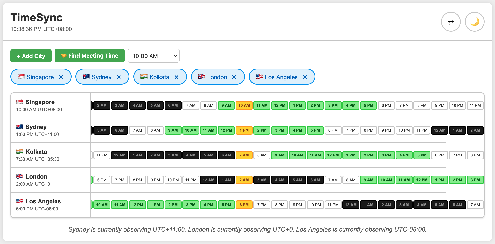

# TimeSync

A beautiful, intuitive timezone converter that helps you coordinate across multiple time zones. Perfect for remote teams, international meetings, and global collaboration.

*Interactive timeline showing multiple time zones with color-coded work hours, sleep hours, and meeting time suggestions. [View more screenshots](SCREENSHOTS.md)*

## Features

### Core Functionality
- **Multiple Timezone Visualization**: View times across multiple cities simultaneously with an interactive timeline
- **Meeting Time Finder**: Automatically find the best meeting times that work for all selected timezones
  - Tier 1: Ideal times (9 AM - 6 PM for all locations)
  - Tier 2: Acceptable times (8 AM - 7 PM for all locations)
  - Tier 3: Possible times (avoids midnight - 7 AM)
- **Time Selection**: View any hour of the day across all selected timezones
- **City Search**: Quick search functionality to find and add cities from 40+ major locations worldwide

### Visual Features
- **Sleep Hours Highlighting**: Midnight black styling for 12 AM - 7 AM to avoid scheduling during sleep hours
- **Work Hours Highlighting**: Visual indication of standard work hours (9 AM - 6 PM)
- **Current Hour Indicator**: Clearly shows the current time across all timezones
- **City Flags**: Country flags for quick visual identification
- **UTC Offset Display**: Real-time UTC offset information for each city
- **DST Awareness**: Displays Daylight Saving Time information when applicable

### User Experience
- **Dark/Light Theme**: Toggle between themes with persistent preference
- **Horizontal/Vertical Layout**: Switch between layout orientations for different viewing preferences
- **Auto-scrolling**: Automatically scrolls to the current or selected hour
- **Persistent Settings**: All your preferences and selected cities are saved locally
- **Responsive Design**: Works seamlessly across different screen sizes

## Getting Started

### Prerequisites
- A modern web browser (Chrome, Firefox, Safari, Edge)
- No installation or build process required!

### Usage

1. **Open the Application**
   - Simply open `timezone.html` in your web browser
   - Or host it on any web server

2. **Add Cities**
   - Click the "+ Add City" button
   - Search for a city or select from the dropdown
   - Double-click or press Enter to quickly add a city

3. **Find Meeting Times**
   - Add at least 2 cities
   - Click the "🤝 Find Meeting Time" button
   - View the best available meeting times for all selected locations

4. **Customize Your Experience**
   - Toggle between light/dark themes (🌙/☀️)
   - Switch between horizontal/vertical layouts (⇄/⇅)
   - Select different times from the dropdown to see how timezones align

## Supported Cities

TimeSync includes 40+ major cities across the globe:

**Americas**: Los Angeles, New York, Toronto, Chicago, Denver, Mexico City, São Paulo, Buenos Aires

**Europe**: London, Paris, Frankfurt, Berlin, Rome, Madrid, Amsterdam, Stockholm, Moscow, Istanbul

**Asia**: Singapore, Hong Kong, Tokyo, Seoul, Beijing, Shanghai, Bangkok, Kuala Lumpur, Manila, Jakarta, Kolkata, Mumbai, Dubai

**Africa**: Cairo, Johannesburg

**Oceania**: Sydney, Melbourne, Perth, Auckland

## Technical Details

- **Pure JavaScript**: No frameworks or dependencies required
- **Local Storage**: All preferences are stored in your browser
- **Intl.DateTimeFormat API**: Uses native browser APIs for accurate timezone calculations
- **DST Aware**: Automatically handles Daylight Saving Time transitions
- **Real-time Updates**: Clock updates every second, timezone display refreshes every minute

## Files

- `timezone.html` - Main HTML structure
- `timezone.js` - Application logic and timezone calculations
- `timezone.css` - Styling and themes

## Browser Compatibility

TimeSync works on all modern browsers that support:
- ES6+ JavaScript
- Intl.DateTimeFormat API
- CSS Grid and Flexbox
- localStorage

## Contributing

Contributions are welcome! Feel free to:
- Report bugs
- Suggest new features
- Add more cities
- Improve the UI/UX
- Enhance accessibility

## License

This project is open source and available for personal and commercial use.

## Tips

- **Keyboard Shortcuts**: Press Enter in the city search to quickly add the first matching city
- **Quick Add**: Double-click a city in the dropdown to add it immediately
- **Meeting Planning**: Use the meeting time finder before scheduling calls to ensure convenient times for everyone
- **Time Travel**: Use the time selector dropdown to plan ahead and see how different times align across zones

## Acknowledgments

Built with consideration for global teams and remote workers who need to coordinate across time zones effectively.
