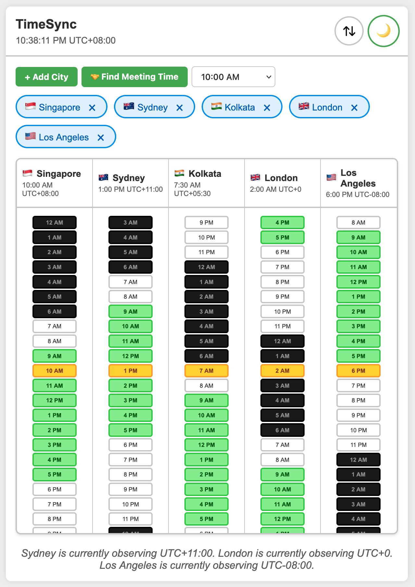
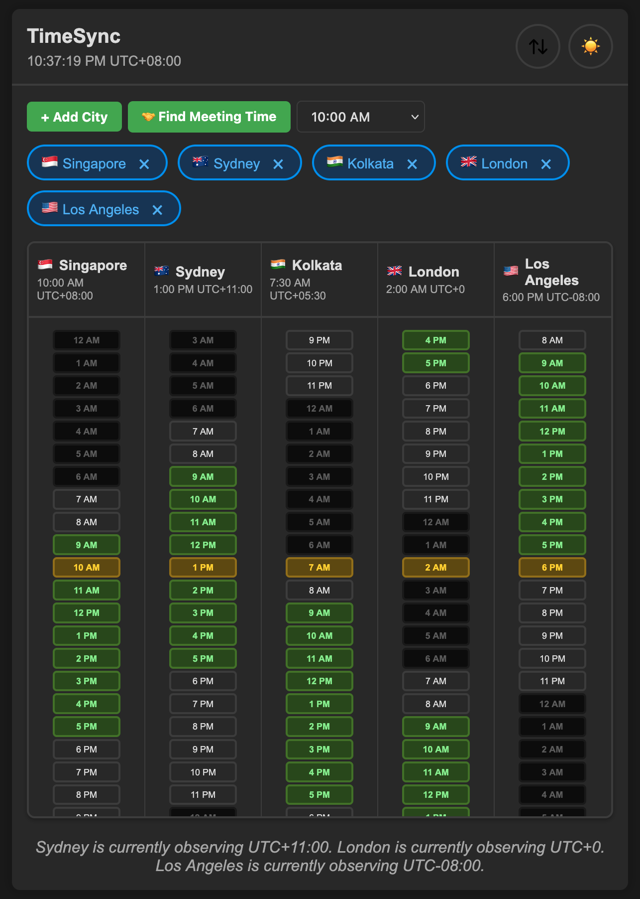

# TimeSync Screenshots

This document showcases the different views and themes available in TimeSync.

## Light Theme - Horizontal Layout

**screenshot-light-h.png**

The horizontal timeline view in light theme provides a clean, professional interface perfect for understanding time zones at a glance. Features include:
- Interactive timeline showing all 24 hours for each city
- Color-coded time blocks:
  - **Green**: Standard work hours (9 AM - 6 PM)
  - **Yellow/Orange**: Currently selected hour
  - **Black**: Sleep hours (12 AM - 7 AM)
  - **Gray**: Other hours
- Country flags for quick city identification
- UTC offset display for each location
- Horizontal scrolling to view the full day across all time zones
- Current time indicator highlighting the selected hour

This view is ideal for quickly identifying overlap in work hours across multiple time zones and finding suitable meeting times.

---

## Light Theme - Vertical Layout

**screenshot-light-v.png**

The vertical card layout in light theme organizes each city into its own column, displaying a complete 24-hour schedule vertically. Features include:
- Dedicated column for each city showing all hours
- Same color-coding scheme as horizontal view
- Scrollable vertical timeline for each location
- Compact card design with city name, current time, and UTC offset
- Better suited for comparing specific time slots across multiple cities
- Ideal for viewing on taller displays or when you need to see the full day schedule at once

This layout excels when you want to scan through different times of the day to find the best meeting slots across all locations.

---

## Dark Theme - Horizontal Layout

**screenshot-dark-h.png**

The horizontal timeline view in dark theme offers a modern, eye-friendly interface for extended use. Features include:
- Same horizontal timeline functionality as the light theme
- Dark background reduces eye strain during long planning sessions
- Enhanced contrast for time block colors
- Sleep hours blend naturally with the dark background
- Work hours (green) and selected hours (yellow/orange) stand out prominently
- Perfect for nighttime use or low-light environments

The dark theme maintains all the functionality of the light theme while providing a sleek, modern aesthetic that's easier on the eyes.

---

## Dark Theme - Vertical Layout

**screenshot-dark-v.png**

The vertical card layout in dark theme combines the detailed column view with a sophisticated dark interface. Features include:
- Columnar organization showing complete 24-hour schedules
- Dark background ideal for reducing eye fatigue
- High contrast time blocks for easy scanning
- City pills with blue borders for clear visual separation
- Sleep hours (black) naturally integrate with the dark theme
- Excellent for focused work in dim lighting conditions

This view is perfect for users who prefer dark interfaces and need to carefully compare time slots across multiple time zones.

---

## Comparing Layouts

### When to Use Horizontal Layout
- Quick overview of time overlap across zones
- Finding meeting times at a glance
- Presenting to others in meetings
- Wide-screen displays
- Emphasizing the timeline aspect

### When to Use Vertical Layout
- Detailed time slot comparison
- Planning across the full 24-hour day
- Taller display configurations
- When you need to see all hours simultaneously
- Focusing on specific time windows

### When to Use Light Theme
- Daytime use
- Screen sharing and presentations
- Documentation and screenshots
- High ambient light environments
- Traditional professional contexts

### When to Use Dark Theme
- Nighttime use
- Extended planning sessions
- Low-light environments
- Reducing eye strain
- Modern, sleek aesthetic preference

---

## Theme and Layout Switching

TimeSync makes it easy to switch between themes and layouts:
- **Theme Toggle**: Click the sun (☀️) or moon (🌙) icon in the top-right corner
- **Layout Toggle**: Click the horizontal (⇄) or vertical (⇅) icon in the top-right corner
- **Persistent Settings**: Your preferences are automatically saved and restored on your next visit

All four combinations (light horizontal, light vertical, dark horizontal, dark vertical) are available with a single click, allowing you to choose the view that works best for your current needs and environment.
